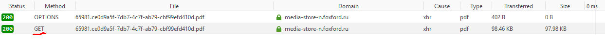
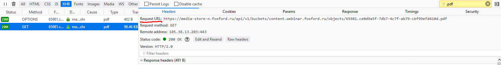

#### _Это - инструкция по сохранению презентаций напрямую из уроков курсов Фоксфорда._

Суть заключается в использовании встроенных в браузер инструментов.

1. Открываем инструменты. Достаточно нажать ПКМ по свободному пространству на странице и выбрать что-то вроде "Inspect element".

2. Переходим во вкладку _Network_.

3. Ищем по расширению (в данном случае - `.pdf`)

4. Выбираем на странице вкладку с презентацией

5. Если в окне с презентацией появилась большая кнопка со стрелочкой, тогда на нее нужно просто нажать и сохранить презентацию. В противном случае, идем дальше.

6. Должно появиться два запроса. Если не появилось - попробуйте поискать по-другому (отсортировать по размеру, типу итд).

7. Выбираем запрос с методом GET и копируем Request URL.

8. Вставляем в адресную строку браузера и сохраняем.
