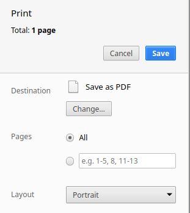

#### _Это - инструкция по сохранению теории к урокам курсов Фоксфорда._

1. Перейти на страницу с теорией вида "https://foxford.ru/lessons/[id]/conspects/[id]"

2. Развернуть все спойлеры.

3. Нажать `Shift + Ctrl + I` и выполнить в консоли `window.print();`. Откроется диалог печати, в котором нужно выставить всё, как показано на скриншоте ниже, и нажать "Save".

